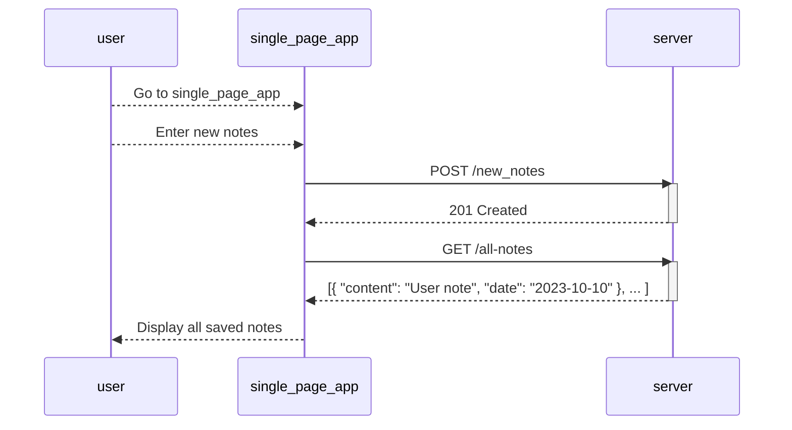

```mermaid
sequenceDiagram
participant user
participant single_page_app
participant server

    user -->> single_page_app: Go to single_page_app
    user -->> single_page_app: Enter new notes
    single_page_app->>server: POST /new_notes
    activate server
    server-->>single_page_app: 201 Created
    deactivate server

    single_page_app->>server: GET /all-notes
    activate server
    server-->>single_page_app: [{ "content": "User note", "date": "2023-10-10" }, ... ]
    deactivate server

    single_page_app-->>user: Display all saved notes


```
