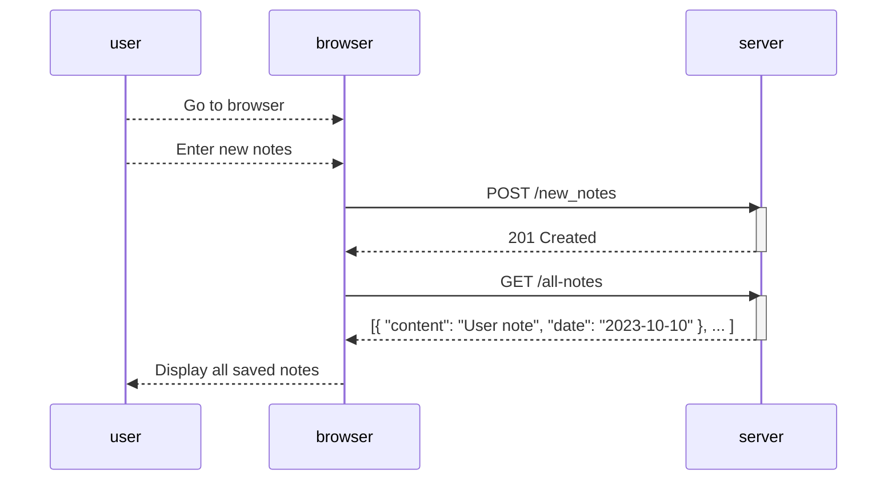

```mermaid
sequenceDiagram
participant user
participant browser
participant server

    user -->> browser: Go to browser
    user -->> browser: Enter new notes
    browser->>server: POST /new_notes
    activate server
    server-->>browser: 201 Created
    deactivate server

    browser->>server: GET /all-notes
    activate server
    server-->>browser: [{ "content": "User note", "date": "2023-10-10" }, ... ]
    deactivate server

    browser-->>user: Display all saved notes


```
